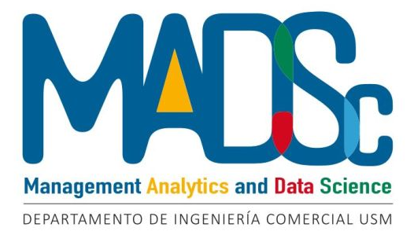

# MADSc Workshops

Este espacio ha sido creado para proporcionar todos los materiales necesarios para los talleres organizados por el centro de Management Analytics and Data Science (MADSc). Aquí encontrarás las carpetas correspondientes a cada uno de nuestros talleres, diseñados para impulsar investigaciones en ciencia de datos aplicadas a la economía y los negocios.

**MADSc** une a expertos académicos e industriales para abordar problemas del sector y ofrece soluciones prácticas mediante alianzas con empresas como Tinet. A través de este repositorio, te invitamos a explorar, descargar material y prepararte para una experiencia educativa enriquecedora. **¡Nos vemos en los Talleres del MADSc!**