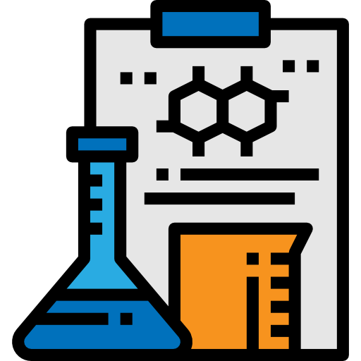

# MADSc - Workshops

## ¿Qué es el MADSc ?

**MADSc** se dedica a impulsar investigaciones que empleen herramientas de ciencia de datos en el ámbito de la economía y los negocios. Nuestro enfoque abarca tanto objetivos académicos como la resolución de problemas específicos que enfrenta la industria. Para alcanzar estos objetivos, reunimos a expertos de los ámbitos académico e industrial, incluyendo académicos de la USM y otras universidades de Chile y el extranjero. Esta diversidad fortalece nuestras investigaciones con múltiples perspectivas y enfoques.

 en la práctica, proporcionando soluciones efectivas a los desafíos en economía y negocios.

**Objetivos**

1. Impulsar investigaciones que utilicen herramientas de ciencia de datos en economía y negocios.
2. Proporcionar soluciones prácticas a los desafíos enfrentados por la industria en estos campos.
3. Aportar la perspectiva universitaria en economía y negocios, con un enfoque técnico en el diseño y la formulación de propuestas para la industria.

## ¿Qué tratan los Workshops?

Nuestros talleres están diseñados para abordar una variedad de temas clave en el campo de la ciencia de datos aplicada a la economía y los negocios. Cada taller se centra en áreas específicas que son fundamentales para enfrentar los desafíos actuales en estos sectores. A continuación, se presentan los principales temas que cubrimos:

- **Análisis de Datos y Modelado Predictivo**: Aprenderás a aplicar técnicas de análisis de datos para extraer insights significativos y construir modelos predictivos que ayuden a tomar decisiones informadas en el ámbito empresarial.

- **Optimización de Procesos**: Exploraremos métodos para mejorar y optimizar procesos dentro de las organizaciones, utilizando herramientas de ciencia de datos para aumentar la eficiencia y reducir costos.

- **Visualización de Datos**: Te enseñaremos cómo presentar datos de manera efectiva a través de visualizaciones claras y comprensibles, facilitando la interpretación y comunicación de los resultados analíticos.

- **Machine Learning Aplicado**: Profundizaremos en técnicas de aprendizaje automático que puedes aplicar directamente a problemas reales en economía y negocios, desde la clasificación hasta la regresión y el clustering.

- **Casos de Estudio y Proyectos Prácticos**: Trabajaremos en proyectos reales y casos de estudio que reflejan desafíos y escenarios actuales en la industria, permitiéndote aplicar lo aprendido en situaciones prácticas.
