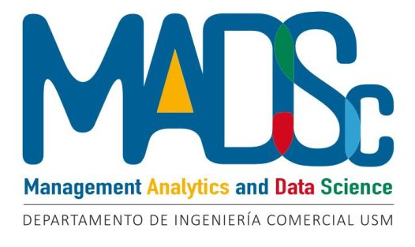

# MADSc - Workshops

[MADSc](https://comercial.usm.cl/management-analytics-an-data-science/) impulsa investigaciones en economía y negocios utilizando ciencia de datos, con un enfoque académico y de resolución de problemas industriales. Reúne a expertos académicos e industriales, tanto de Chile como del extranjero, para aportar diversas perspectivas.

**Objetivos**:

- Fomentar investigaciones en ciencia de datos para economía y negocios.
- Proporcionar soluciones prácticas a la industria.
- Aportar enfoques técnicos desde la academia para propuestas industriales.

### ¿Qué tratan los Workshops?

Nuestros talleres cubren temas clave de ciencia de datos aplicada a la economía y los negocios:

- **Análisis de Datos y Modelado Predictivo**: Aprende a extraer insights y construir modelos para decisiones informadas.
- **Optimización de Procesos**: Mejora la eficiencia y reduce costos utilizando ciencia de datos.
- **Visualización de Datos**: Presenta información de manera clara y comprensible.
- **Machine Learning Aplicado**: Aplica técnicas de machine learning a problemas reales.
- **Casos de Estudio y Proyectos Prácticos**: Trabaja en proyectos reales, aplicando lo aprendido a desafíos actuales.

